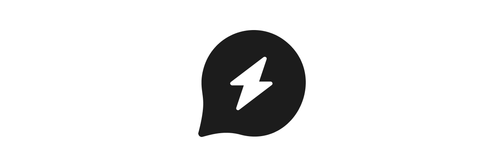

# GPT-Null Project Template

Since GPT-Null is an open organization welcoming anyone to contribute, we have created a project template for you to follow when creating a new repository. This include templates for the `README.md` file and a `LICENSE` file. All projects should use the [MIT License](https://opensource.org/licenses/MIT) unless otherwise specified.

All projects have one _owner_, which is responsible for the project. The owner is the person who created the project and is responsible for maintaining it. Projects are generally open to contributions from anyone, but the owner has the final say on what changes are made to the project.

**This template is not a requirement, but a strong recommendation to follow in order to stay consistent across all GPT-Null projects.**

## Assets

You can find all _GPT-Null_ assets in the [assets](./assets) directory. This includes the logo, banner and other files.

## Files

### README.md

```markdown
 <!-- Optional, or use whatever banner you want >

# [title]

## Description

[description]

## Contributors

-   **Owner:** [name] <[email]> <!-- John Doe <john.doe@domain.com> -->
-   **Contributors:**
-   -   [name] <[email]>
-   -   [name] <[email]>

## Requirements

-   **[requirement]:** [version] <!-- [version] or higher -->

## Installation

[installation instructions]

## Usage

[usage instructions (if any)]

## Development

[development instructions (if any)]

## Testing

[testing instructions (if any)]

## Deployment

[deployment instructions (if any)]

## Contributing

[contributing instructions (if any)]

## License

This project is licensed under the [MIT License](./LICENSE).
```

### LICENSE

```markdown
MIT License

Copyright (c) [year] [fullname]

Permission is hereby granted, free of charge, to any person obtaining a copy
of this software and associated documentation files (the "Software"), to deal
in the Software without restriction, including without limitation the rights
to use, copy, modify, merge, publish, distribute, sublicense, and/or sell
copies of the Software, and to permit persons to whom the Software is
furnished to do so, subject to the following conditions:

The above copyright notice and this permission notice shall be included in all
copies or substantial portions of the Software.

THE SOFTWARE IS PROVIDED "AS IS", WITHOUT WARRANTY OF ANY KIND, EXPRESS OR
IMPLIED, INCLUDING BUT NOT LIMITED TO THE WARRANTIES OF MERCHANTABILITY,
FITNESS FOR A PARTICULAR PURPOSE AND NONINFRINGEMENT. IN NO EVENT SHALL THE
AUTHORS OR COPYRIGHT HOLDERS BE LIABLE FOR ANY CLAIM, DAMAGES OR OTHER
LIABILITY, WHETHER IN AN ACTION OF CONTRACT, TORT OR OTHERWISE, ARISING FROM,
OUT OF OR IN CONNECTION WITH THE SOFTWARE OR THE USE OR OTHER DEALINGS IN THE
SOFTWARE.
```
